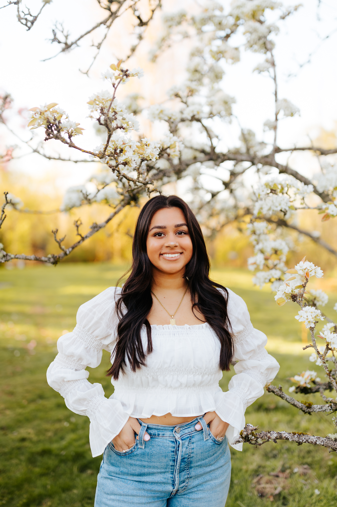
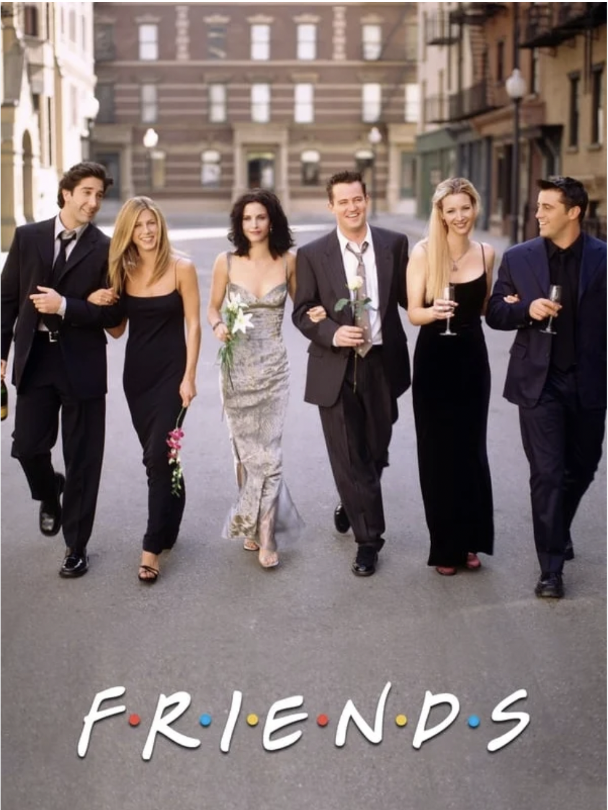

# Esha Thakur 

## *About Me :* 
- **Age :** 20  
- **Zodiac Sign :** Libra  
- **School :** UCSD  
- **Hometown :** Seattle, Washington
  
**Jump to my To-Do List Section :** [To-Do List](#to-do-list)  

## *Fun Facts :* 
**a Favorite Movie :** Aquamarine  
**Favorite Cuisines :** Indina/Italian/Thai  
**a Favorite TV Show :** Friends  
a famous quote from the show: 
>"We were on a break"

## *Here are 5 more random facts about me:* 
1. I have 1 sibling, we are 4 years apart, her name is Riya and she lives in san diego!
2. My family has 1 dog, she is an australian labradoodle and her name is Charlie
3. I did a study abroad program in Berlin, Germany this past summer and had my first internship at the start-up company delphai
4. For the first 3 years of my life I lived in Ghana, Africa
5. Me and my mom loce doing the Wordle

## *To Do List:* 
- [ ] Submit Lab 1
- [x] Make slack account
- [ ] Message Professor Powell on Slack
- [ ] Attend CSE110 Lecture

**First line of code I ever learned :** ``System.out.print('Hello World!')``  
**An Online Store I Love :** [Princess Polly](https://us.princesspolly.com)  
**Link to a Surprise File :**[Surprise](./Other.md)

